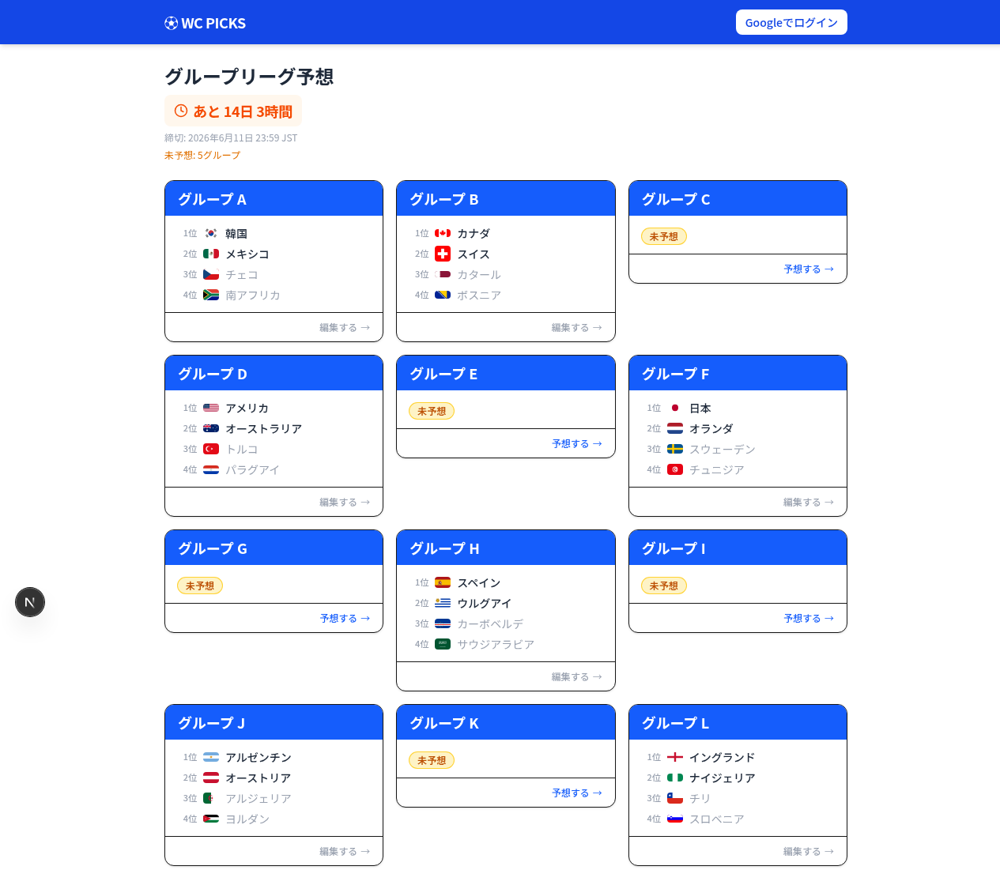
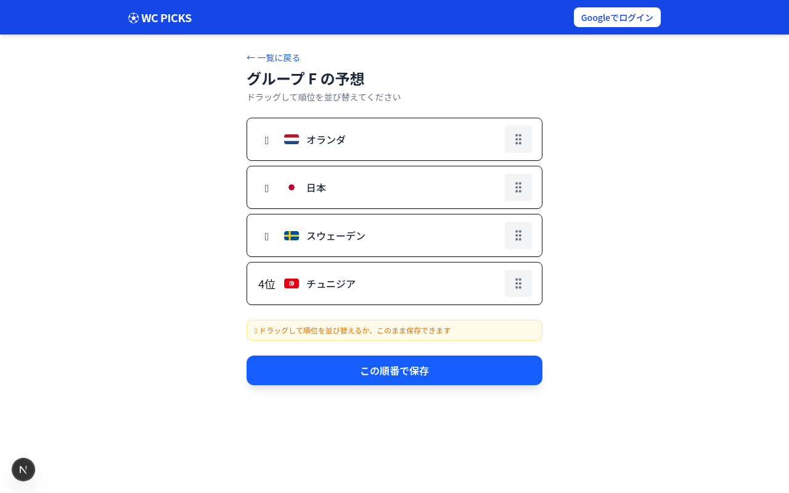
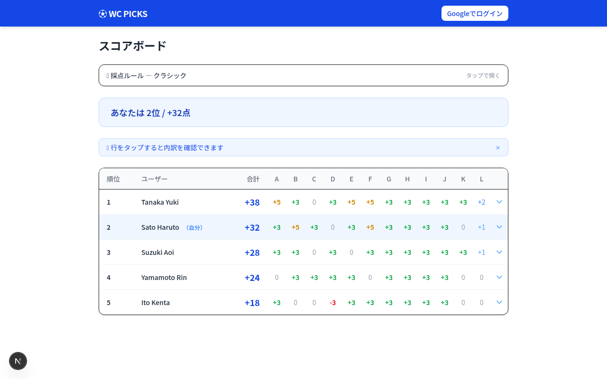
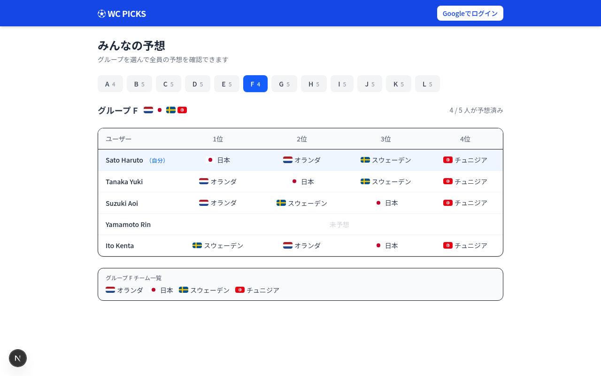
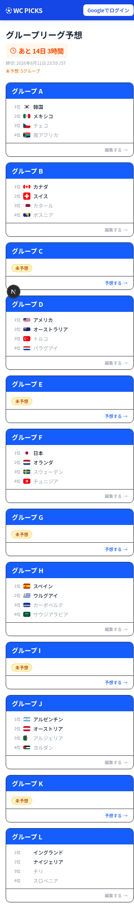
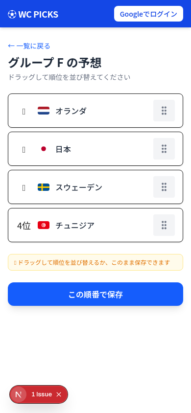

# ⚽ WC PICKS — 2026 FIFA World Cup Group Stage Predictor

[日本語版はこちら](README.ja.md)

A self-hostable web app for predicting the 2026 FIFA World Cup group stage standings with friends.  
Everyone submits their predictions before the deadline, then scores are calculated automatically once official results are entered.

---

## Screenshots

| Dashboard | Drag & Drop Prediction |
|:---:|:---:|
|  |  |

| Scoreboard | Everyone's Predictions |
|:---:|:---:|
|  |  |

<details>
<summary>📱 Mobile</summary>

| Home | Predict |
|:---:|:---:|
|  |  |

</details>

---

## Features

- **Google Sign-In** — one-click login, no passwords
- **Drag & Drop** predictions for all 12 groups
- **4 scoring patterns** selectable by the admin
- **Automatic scoring** once results are entered
- **Scoreboard** with per-group breakdown
- **Predictions reveal** — everyone's picks are hidden until the deadline passes
- **Mobile-friendly** responsive design
- **Self-hostable** on Firebase free tier

---

## Scoring Rules

The admin chooses one of four scoring patterns before the deadline. The default is **Classic**.

### Classic (default)

| Condition | Points |
|---|---|
| All 4 teams in exact order | **+5** |
| Top 2 and bottom 2 teams correct (order doesn't matter) | **+3** |
| Predicted 1st place team is eliminated in the group stage | **−3** |

- +5 and +3 are mutually exclusive (+5 takes priority)
- −3 only applies when neither +5 nor +3 conditions are met

### No Penalty

Same as Classic but without the −3 penalty.

### Per Position

+1 for each correctly placed team (max +4), +1 bonus for a perfect match (total max +5).

### Top Heavy

+3 for 1st correct, +2 for 2nd correct, +1 for 3rd correct — stacked (max +6, no penalty).

---

## Schedule

| Datetime | Event |
|---|---|
| Until 2026-06-11 23:59 JST | Predictions open |
| 2026-06-12 00:00 JST onwards | Everyone's predictions revealed |

---

## Self-Hosting Setup

### Prerequisites

- [Node.js](https://nodejs.org/) 20+
- [Firebase CLI](https://firebase.google.com/docs/cli): `npm install -g firebase-tools`
- A Google account

### 1. Clone & Install

```bash
git clone <this-repo>
cd wc-picks
npm install
```

### 2. Create a Firebase Project

1. Go to [https://console.firebase.google.com/](https://console.firebase.google.com/)
2. Click **Add project** → enter any project name
3. Google Analytics: **disabled** is fine
4. Wait for the project to be created

### 3. Enable Authentication

1. Firebase console → **Authentication** → **Get started**
2. Enable **Google** sign-in → set a support email → Save
3. Under **Settings → Authorized domains**, add your hosting domain when you deploy

### 4. Enable Firestore

1. Firebase console → **Firestore Database** → **Create database**
2. Region: choose the one closest to your users (e.g. `asia-northeast1` for Japan)
3. Security rules: **Start in test mode** (the correct rules will be deployed in step 7)

### 5. Register a Web App & Get Config

1. Firebase console → Project Overview → **`</>`** (Web)
2. Enter a nickname (e.g. `wc-picks-web`) → **Register app**
3. Copy the `firebaseConfig` values shown

### 6. Configure Environment Variables

```bash
cp .env.local.example .env.local
```

Open `.env.local` and fill in the values from the `firebaseConfig` above:

```
NEXT_PUBLIC_FIREBASE_API_KEY=...
NEXT_PUBLIC_FIREBASE_AUTH_DOMAIN=...
NEXT_PUBLIC_FIREBASE_PROJECT_ID=...
NEXT_PUBLIC_FIREBASE_STORAGE_BUCKET=...
NEXT_PUBLIC_FIREBASE_MESSAGING_SENDER_ID=...
NEXT_PUBLIC_FIREBASE_APP_ID=...
NEXT_PUBLIC_FIREBASE_DATABASE_ID=default
NEXT_PUBLIC_APP_URL=https://<your-project-id>.web.app
```

### 7. Connect Firebase CLI & Deploy Rules

```bash
firebase login
firebase use <your-project-id>
firebase deploy --only firestore:rules
```

### 8. Set Up Your Admin Account

You need at least one admin to enter match results via the `/admin` page.

1. Run the app locally (`npm run dev`) and sign in with your Google account
2. In Firebase console → Firestore → create a collection named **`allowlist`**
3. Add a document with **your Gmail address** as the document ID:
   - Field: `role` → value: `"admin"` (string)
   - Field: `addedAt` → value: current timestamp

### 9. Deploy to Firebase Hosting

```bash
npm run deploy
```

This runs `clean → build → firebase deploy --only hosting` in sequence.

Your app will be live at `https://<your-project-id>.web.app`.

---

## Local Development

```bash
npm run dev        # http://localhost:3000
npm test           # run unit tests (watch mode)
npm run test:run   # run unit tests once (no watch)
npm run test:e2e   # run E2E tests (Playwright)
npm run emulator   # start Firebase emulators
```

---

## Entering Match Results (Admin)

1. Sign in with your admin Google account
2. Go to `/admin`
3. For each group, drag teams into the final standings order
4. Toggle the **3rd place** toggle for groups where the 3rd-place team advances
5. Click **Save** — scores update automatically for all participants

---

## File Structure

```
wc-picks/
├── src/
│   ├── app/
│   │   ├── page.tsx              # Home (group list & prediction status)
│   │   ├── predict/[group]/      # Prediction input (drag & drop)
│   │   ├── predictions/          # Everyone's predictions (post-deadline)
│   │   ├── scores/               # Scoreboard
│   │   └── admin/                # Admin: enter match results & scoring pattern
│   ├── components/
│   ├── contexts/
│   │   ├── AuthContext.tsx       # Firebase Auth state
│   │   └── PredictionsContext.tsx# Shared prediction data across pages
│   ├── data/
│   │   └── groups.ts             # 12 groups × 4 teams
│   ├── hooks/
│   │   ├── useAuth.ts
│   │   └── usePredictions.ts
│   └── lib/
│       ├── constants.ts          # DEADLINE, REVEAL, scoring patterns
│       ├── firebase.ts           # Firebase initialization
│       ├── firestore.ts          # Firestore read/write
│       ├── scoring.ts            # Scoring logic (pure functions)
│       └── utils.ts              # Shared utilities
├── firestore.rules               # Security rules
├── firebase.json                 # Firebase config
└── .env.local.example            # Environment variable template
```

---

## Tech Stack

- [Next.js](https://nextjs.org/) (Static Export)
- [Firebase](https://firebase.google.com/) — Authentication, Firestore, Hosting
- [Tailwind CSS](https://tailwindcss.com/)
- [@dnd-kit](https://dndkit.com/) — drag & drop

---

## License

MIT
